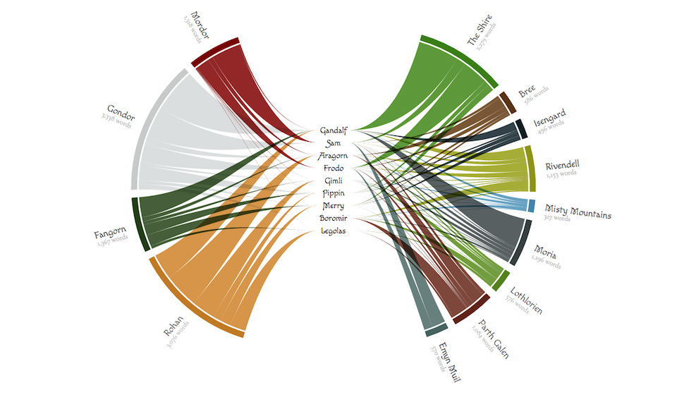

# d3-loom

For an extensive explanation of the effects of all the settings decribed farther below, please see the [blog/tutorial I wrote about the loom here](https://www.visualcinnamon.com/2017/08/d3-loom.html).

This is a d3 plugin to create a "loom" visualization. I don't actually know node.js, thereby no npm, so if you feel this repo isn't a fully fledged plugin, because it's missing a lot of files (and isn't on npm), I'm fine with that. I just wanted to share a way for others to make use of a new chart layout in d3 that was within my abilities (but any help in turning this into a proper plugin would be appreciated!).

[](https://bl.ocks.org/nbremer/4530f11952a3ef7e007ad6ef93d5adb3)

The loom layout is meant to create a chart with a group of entities in the center and different group of entities on the outside. They are connected by *strings* where the thickness of the string on the outside represents the connection (i.e. value) of the inner and outer entity.

For example, in the above image, the inner entities are the characters of the Fellowship in the Lord of the Rings movies. The outer entities are the locations in Middle Earth where the movie takes place. The connection/value is the number of words spoken by each character at each location.

Since this layout was transformed from d3's [chord diagram](https://github.com/d3/d3-chord/blob/master/README.md) many of the below API references will be similar to those from the chord diagram for the *loom* and similar to the ribbon functions for the *strings*.

## Installing

You must include the [d3 library](http://d3js.org/) before including the loom file. Then you can add the loom.js file to your website

```html
<script src="https://d3js.org/d3.v4.min.js"></script>
<script src="loom.js"></script>

<script>

var loom = d3.loom();

</script>
```

## Note

One thing that I have not (yet) figured out is how to sort the outer groups/entities in such a way to automatically make a visually appealing split in 2 separate halves. This is only relevant when you specify an [empty percentage](#loom_emptyPerc), thus create a gap in the top and bottom. For now you will have to manually order the outer entities in such a way that when split into two groups, the total value of those two groups separately lies close to 50%. However, you don't need to have the exact number of entities on the left half as on the right. The program will try and find a split that separates all the entities in two groups to make them both as close to 50% as possible, but it will not reorder the outer entities to do so.

## Feedback

This is my first attempt at a plugin and it has definitely not been tested well enough. I would therefore love to hear from you about any bugs or errors that you run into while trying to use the plugin. You can create an Issue right here, reach me on Twitter via [@NadiehBremer](https://www.twitter.com/NadiehBremer) or mail me on info *at* visualcinnamon.com


## API Reference

<a href="#loom" name="loom">#</a> d3.<b>loom</b>()

Constructs a new loom generator with the default settings.

<a href="#_loom" name="_loom">#</a> <i>loom</i>(<i>data</i>)

Computes the loom layout for the specified *data*. The length of the returned array is the same as *data*, however, due to sorting of the strings, to reduce overlap, the ordering can be different than the initial data. 

Typically a dataset for the *loom* contains 3 values; the outer entity, the inner entity and the value that connects these two (e.g. outer = location, inner = person, value = days that person stayed in the location):

```js
var data = [
  {
    outer: "Amsterdam",
    inner: "Alexander",
    value: 679
  },
  {
    outer: "Bangkok",
    inner: "Brendan",
    value: 124
  },
  //...and so on
];
```

The return value of *loom*(*data*) is an array of *looms*, where each loom represents the connection between an entity in the center of the loom (the *inner*) and the entity on the outside of the loom (the *outer*) and is an object with the following properties:

* `inner` - the inner subgroup
* `outer` - the outer subgroup

Both the inner and outer subgroup are also objects. The inner has the following properties:

* `name` - the [name](#loom_inner) of the inner entity
* `offset` - the [horizontal offset](#loom_widthInner) of the inner string's endpoint from the center
* `x` - the horizontal location of the inner entity
* `y` - the vertical location of the inner entity

And the outer has the following properties:

* `groupStartAngle` - the [start angle](#string_groupStartAngle) of the outer group to which the specific string belongs
* `startAngle` - the [start angle](#string_startAngle) of the string at the outer edge in radians
* `endAngle` - the [end angle](#string_endAngle) of the string at the outer edge in radians
* `value` - the numeric [value](#loom_value) of the string
* `index` - the zero-based [sorted index](#loom_sortGroups) of the group
* `subindex` - the zero-based [sorted sub-index](#loom_sortSubgroups) of the string within the group
* `innername` - the [name](#loom_inner) of the connected inner entity
* `outername` - the [name](#loom_outer) of the outer entity

The *looms* are passed to [d3.string](#string) to display the relationships between the inner and outer entities.

The *looms* array also defines a two secondary arrays. The first, called *groups*, is an array representing the outer entities. The length of the array is the number of unique outer entities and is an object with the following properties:

* `startAngle` - the [start angle](#string_startAngle) of the arc in radians
* `endAngle` - the [end angle](#string_endAngle) of the arc in radians
* `value` - the numeric [value](#loom_value) of the arc
* `index` - the zero-based [sorted index](#loom_sortGroups) of the arc
* `outername` - the [name](#loom_outer) of the outer entity

The *groups* are passed to [d3.arc](https://github.com/d3/d3-shape#arc) to produce a donut chart around the circumference of the loom layout.

The other array, called, *innergroups*, is an array represting the inner entities. The length of the array is the number of unique inner entities and is an object with the following properties:

* `name` - the [name](#loom_inner) of the inner entity
* `offset` - the [horizontal offset](#loom_widthInner) of the inner string's endpoint from the center
* `x` - the horizontal location of the inner entity
* `y` - the vertical location of the inner entity

The *innergroups* are used to create the textual representation of the inner entities in the center of the loom layout.

<a href="#loom_padAngle" name="loom_padAngle">#</a> <i>loom</i>.<b>padAngle</b>([<i>angle</i>]) [<>](https://github.com/nbremer/d3-loom/blob/master/loom.js#L195 "Source")

If *angle* is specified, sets the pad angle (i.e. the white space) between adjacent outer groups to the specified number in radians and returns this loom layout. If *angle* is not specified, returns the current pad angle, which defaults to zero.

<a href="#loom_inner" name="loom_inner">#</a> <i>loom</i>.<b>inner</b>([<i>inner</i>]) [<>](https://github.com/nbremer/d3-loom/blob/master/loom.js#L199 "Source")

The *inner* represents the name/id/... textual value of the entities that will be placed in the center. If *inner* is specified, sets the inner accessor to the specified function and returns this string generator. If *inner* is not specified, returns the current inner accessor, which defaults to:

```js
function inner(d) {
  return d.inner;
}
```

<a href="#loom_outer" name="loom_outer">#</a> <i>loom</i>.<b>outer</b>([<i>outer</i>]) [<>](https://github.com/nbremer/d3-loom/blob/master/loom.js#L203 "Source")

The *outer* represents the name/id/... textual value of the entities that will be placed around the loom along a circle. If *outer* is specified, sets the outer accessor to the specified function and returns this string generator. If *outer* is not specified, returns the current outer accessor, which defaults to:

```js
function outer(d) {
  return d.outer;
}
```

<a href="#loom_value" name="loom_value">#</a> <i>loom</i>.<b>value</b>([<i>value</i>]) [<>](https://github.com/nbremer/d3-loom/blob/master/loom.js#L207 "Source")

The *value* represents the numeric value that is the connection between the inner and outer entity. It is the value that determines the width of the strings on the outside. If *value* is specified, sets the value accessor to the specified function and returns this string generator. If *value* is not specified, returns the current value accessor, which defaults to:

```js
function value(d) {
  return d.value;
}
```

<a href="#loom_heightInner" name="loom_heightInner">#</a> <i>loom</i>.<b>heightInner</b>([<i>height</i>]) [<>](https://github.com/nbremer/d3-loom/blob/master/loom.js#L211 "Source")

This *height* gives the vertical distance between the inner entities in the center. If *height* is specified, sets the heightInner to the specified number and returns this loom generator. If height is not specified, returns the current heightInner value, which defaults to 20 pixels.

<a href="#loom_widthInner" name="loom_widthInner">#</a> <i>loom</i>.<b>widthInner</b>([<i>width</i>]) [<>](https://github.com/nbremer/d3-loom/blob/master/loom.js#L215 "Source")

This *width* gives the horizontal distance between the inner endpoints of the strings in the center. It is the value that determines the width of the gap that is created so the text of the inner entities does not overlap the strings. If *width* is specified, sets the widthInner to the specified function or number and returns this loom generator. However, note that this function receives a *d* value that contains the string of the entity in the center (the *inner*). You can therefore make the width depend on the length of the *inner*'s string. If width is not specified, returns the current widthInner value, which defaults to 30 pixels.

<a href="#loom_emptyPerc" name="loom_emptyPerc">#</a> <i>loom</i>.<b>emptyPerc</b>([<i>value</i>]) [<>](https://github.com/nbremer/d3-loom/blob/master/loom.js#L219 "Source")

This *value* gives the percentage of the circle that will be empty to create space in the top and bottom. If *value* is specified, sets the current emptyPerc to the specified number in the range [0,1] and returns this loom generator. If value is not specified, returns the current emptyPerc value, which defaults to 0.2.

<a href="#loom_sortGroups" name="loom_sortGroups">#</a> <i>loom</i>.<b>sortGroups</b>([<i>compare</i>]) [<>](https://github.com/nbremer/d3-loom/blob/master/loom.js#L223 "Source")

If *compare* is specified, sets the group comparator to the specified function or null and returns this loom layout. If *compare* is not specified, returns the current group comparator, which defaults to null. If the group comparator is non-null, it is used to sort the outer groups/entities by their total value (i.e. the sum of all the inner strings). See also [d3.ascending](https://github.com/d3/d3-array#ascending) and [d3.descending](https://github.com/d3/d3-array#descending).

<a href="#loom_sortSubgroups" name="loom_sortSubgroups">#</a> <i>loom</i>.<b>sortSubgroups</b>([<i>compare</i>]) [<>](https://github.com/nbremer/d3-loom/blob/master/loom.js#L227 "Source")

If *compare* is specified, sets the subgroup comparator to the specified function or null and returns this loom layout. If *compare* is not specified, returns the current subgroup comparator, which defaults to null. If the subgroup comparator is non-null, it is used to sort the subgroups (i.e. the separate strings) within each outer entity by their value. See also [d3.ascending](https://github.com/d3/d3-array#ascending) and [d3.descending](https://github.com/d3/d3-array#descending). This sorting applies to both the order of the strings on the outer edge and the vertical order of the inner entities. It is advised to supply a subGroup sorting whenever there is not already a sorting applied to the underlying data, otherwise the inner entities and the strings will be drawn in the exact order as they appear in the data, typically resulting in a lot of overlapping strings.

<a href="#loom_sortLooms" name="loom_sortLooms">#</a> <i>loom</i>.<b>sortLooms</b>([<i>compare</i>]) [<>](https://github.com/nbremer/d3-loom/blob/master/loom.js#L231 "Source")

If *compare* is specified, sets the loom comparator to the specified function or null and returns this loom layout. If *compare* is not specified, returns the current loom comparator, which defaults to null. If the loom comparator is non-null, it is used to sort the [strings](#_loom) by their value; this only affects the *z*-order of these inner strings (i.e. how they overlap). See also [d3.ascending](https://github.com/d3/d3-array#ascending) and [d3.descending].(https://github.com/d3/d3-array#descending).

<a href="#string" name="string">#</a> d3.<b>string</b>() [<>](https://github.com/nbremer/d3-loom/blob/master/loom.js#L240 "Source")

Creates a new string generator with the default settings.

<a href="#_string" name="_string">#</a> <i>string</i>(<i>arguments…</i>) [<>](https://github.com/nbremer/d3-loom/blob/master/loom.js#L263 "Source")

Generates a string for the given *arguments*. The *arguments* are arbitrary; they are simply propagated to the string's generator's accessor functions along with the `this` object. If the string generator has a context, then the string is rendered to this context as a sequence of path method calls and this function returns void. Otherwise, a path data string is returned.

Typically, only the [radius](#string_radius), [thicknessInner](#string_thicknessInner), and [pullout](#string_pullout) should be adjusted when used on conjunction with the [loom](#loom), because all the other accessors will work with the default settings.

<a href="#string_radius" name="string_radius">#</a> <i>string</i>.<b>radius</b>([<i>radius</i>]) [<>](https://github.com/nbremer/d3-loom/blob/master/loom.js#L343 "Source")

If *radius* is specified, sets the radius accessor to the specified function and returns this string generator. If *radius* is not specified, returns the current radius value, which defaults to 100 pixels.

The *radius* represents the inner radius of the loom and is typically set to a single number. It is advised to always set this value different from the default, depending on the space available within your svg.

<a href="#string_thicknessInner" name="string_thicknessInner">#</a> <i>string</i>.<b>thicknessInner</b>([<i>thickness</i>]) [<>](https://github.com/nbremer/d3-loom/blob/master/loom.js#L367 "Source")

If *thickness* is specified, sets the thicknessInner to the specified number and returns this string generator. If *thickness* is not specified, returns the current thicknessInner value, which defaults to 0 pixels. The thicknessInner defines the "height", or thickness, that the strings will have at their endpoints next to the inner entities.

<a href="#string_pullout" name="string_pullout">#</a> <i>string</i>.<b>pullout</b>([<i>pullout</i>]) [<>](https://github.com/nbremer/d3-loom/blob/master/loom.js#L379 "Source")

If *pullout* is specified, sets the pullout to the specified number and returns this string generator. If *pullout* is not specified, returns the current pullout value, which defaults to 50 pixels. The pullout defines how far the two circle halves will be placed outward horizontally.

<a href="#string_inner" name="string_inner">#</a> <i>string</i>.<b>inner</b>([<i>inner</i>]) [<>](https://github.com/nbremer/d3-loom/blob/master/loom.js#L371 "Source")

If *inner* is specified, sets the inner accessor to the specified function and returns this string generator. If *inner* is not specified, returns the current source accessor, which defaults to:

```js
function inner(d) {
  return d.inner;
}
```

When the string generator is used in conjunction with the *loom*, the resulting loom array will contain an *inner* object. Thus this accessor function does not have to be set separately, but just use the default.

<a href="#string_outer" name="string_outer">#</a> <i>string</i>.<b>outer</b>([<i>outer</i>]) [<>](https://github.com/nbremer/d3-loom/blob/master/loom.js#L375 "Source")

If *outer* is specified, sets the outer accessor to the specified function and returns this string generator. If *outer* is not specified, returns the current outer accessor, which defaults to:

```js
function outer(d) {
  return d.outer;
}
```

When the string generator is used in conjunction with the *loom*, the resulting loom array will contain an *outer* object. Thus this accessor function does not have to be set separately, but just use the default.

<a href="#string_groupStartAngle" name="string_groupStartAngle">#</a> <i>string</i>.<b>groupStartAngle</b>([<i>angle</i>]) [<>](https://github.com/nbremer/d3-loom/blob/master/loom.js#L247 "Source")

If *angle* is specified, sets the start angle accessor to the specified function and returns this string generator. If *angle* is not specified, returns the current start angle accessor, which defaults to:

```js
function groupStartAngle(d) {
  return d.groupStartAngle;
}
```

The *angle* is specified in radians, with 0 at -*y* (12 o'clock) and positive angles proceeding clockwise. This separate assessor is needed to make sure that even when an *emptyPerc* is set, all the strings belonging to the same outer group will be drawn at the same side. It's best make this assessor similar in "function" to the *startAngle* below (i.e. if a constant is added onto the *startAngle* to rotate the whole, then the same constant should be added to the *groupStartAngle*). When the string generator is used in conjunction with the *loom*, the resulting loom array will contain an *groupStartAngle* value within the *outer* object. In that case this accessor function does not have to be set separately, but just use the default.

<a href="#string_startAngle" name="string_startAngle">#</a> <i>string</i>.<b>startAngle</b>([<i>angle</i>]) [<>](https://github.com/nbremer/d3-loom/blob/master/loom.js#L247 "Source")

If *angle* is specified, sets the start angle accessor to the specified function and returns this string generator. If *angle* is not specified, returns the current start angle accessor, which defaults to:

```js
function startAngle(d) {
  return d.startAngle;
}
```

The *angle* is specified in radians, with 0 at -*y* (12 o'clock) and positive angles proceeding clockwise. When the string generator is used in conjunction with the *loom*, the resulting loom array will contain an *startAngle* value within the *outer* object. In that case this accessor function does not have to be set separately, but just use the default.

<a href="#string_endAngle" name="string_endAngle">#</a> <i>string</i>.<b>endAngle</b>([<i>angle</i>]) [<>](https://github.com/nbremer/d3-loom/blob/master/loom.js#L251 "Source")

If *angle* is specified, sets the end angle accessor to the specified function and returns this string generator. If *angle* is not specified, returns the current end angle accessor, which defaults to:

```js
function endAngle(d) {
  return d.endAngle;
}
```

The *angle* is specified in radians, with 0 at -*y* (12 o'clock) and positive angles proceeding clockwise. When the string generator is used in conjunction with the *loom*, the resulting loom array will contain an *endAngle* value within the *outer* object. In that case this accessor function does not have to be set separately, but just use the default.

<a href="#string_x" name="string_x">#</a> <i>string</i>.<b>x</b>([<i>x</i>]) [<>](https://github.com/nbremer/d3-loom/blob/master/loom.js#L355 "Source")

If *x* is specified, sets the x accessor to the specified function and returns this string generator. If *x* is not specified, returns the current x accessor, which defaults to:

```js
function x(d) {
  return d.x;
}
```

The *x* defines the horizontal location where the inner entities are placed, typically in the center of the loom. When the string generator is used in conjunction with the *loom*, the resulting loom array will contain an *x* value within the *inner* object. In that case this accessor function does not have to be set separately, but just use the default.

<a href="#string_y" name="string_y">#</a> <i>string</i>.<b>y</b>([<i>y</i>]) [<>](https://github.com/nbremer/d3-loom/blob/master/loom.js#L359 "Source")

If *y* is specified, sets the y accessor to the specified function and returns this string generator. If *y* is not specified, returns the current y accessor, which defaults to:

```js
function y(d) {
  return d.y;
}
```

The *y* defines the vertical location where the inner entities are placed. They are typically placed in a column like fashion in the center, one above the other. When the string generator is used in conjunction with the *loom*, the resulting loom array will contain an *y* value within the *inner* object. In that case this accessor function does not have to be set separately, but just use the default.

<a href="#string_offset" name="string_offset">#</a> <i>string</i>.<b>offset</b>([<i>offset</i>]) [<>](https://github.com/nbremer/d3-loom/blob/master/loom.js#L363 "Source")

If *offset* is specified, sets the offset accessor to the specified function and returns this string generator. If *offset* is not specified, returns the current offset accessor, which defaults to:

```js
function offset(d) {
  return d.offset;
}
```

The *offset* defines the horizontal space between the inner end points of the strings, so that the text of the inner entities does not overlap the strings. It is typically set through the [widthInner](#loom_widthInner) accessor of the loom and propagates through to the string function. Therefore, when the string generator is used in conjunction with the *loom*, the resulting loom array will contain an *offset* value within the *inner* object. In that case this accessor function does not have to be set separately, but just use the default.

<a href="#string_context" name="string_context">#</a> <i>string</i>.<b>context</b>([<i>context</i>]) [<>](https://github.com/nbremer/d3-loom/blob/master/loom.js#L383 "Source")

If *context* is specified, sets the context and returns this string generator. If *context* is not specified, returns the current context, which defaults to null. If the context is not null, then the [generated string](#_string) is rendered to this context as a sequence of [path method](http://www.w3.org/TR/2dcontext/#canvaspathmethods) calls. Otherwise, a [path data](http://www.w3.org/TR/SVG/paths.html#PathData) string representing the generated string is returned. See also [d3-path](https://github.com/d3/d3-path).
